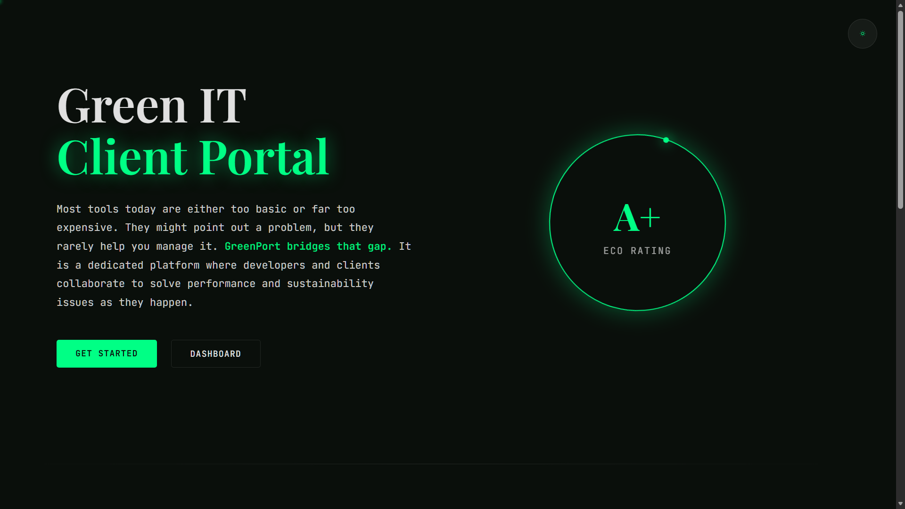
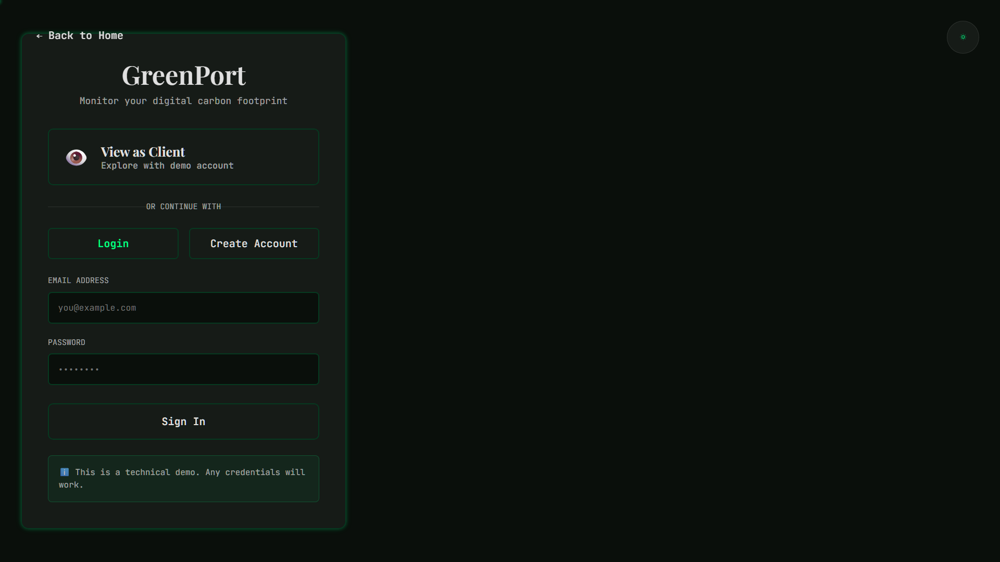

# 🌱 GreenPort - Green IT Client Portal


🚀 **[Live Demo](https://green-port-three.vercel.app)** | 💻 **[GitHub Repo](https://github.com/jeanettesoderman/GreenPort)**

A full-stack web application that combines a client portal with real-time sustainability tracking. GreenPort helps businesses monitor and reduce their website's carbon footprint while providing a seamless project management experience.

## 📸 Screenshots

<div align="center">

| Landing Page | Dashboard | Login |
|:---:|:---:|:---:|
|  |  |  |
| *Animated eco-rating badge* | *Project monitoring* | *Guest demo access* |

</div>

> 📝 **Note:** To add screenshots, run the app and save images to the `screenshots/` folder.

## 💡 The Concept

We talk about sustainability everywhere today, but rarely about the digital aspect. The internet actually emits more CO2 than the aviation industry, yet most companies have no idea how their websites impact the environment.

**GreenPort bridges that gap.** It's not just another CO2 calculator - it's a dedicated platform where developers and clients collaborate to solve performance and sustainability issues as they happen.

### Key Features

- 📊 **Real-time CO2 Tracking**: Live carbon footprint monitoring with historical data visualization
- 🔄 **Automated Audits**: Scheduled carbon analysis keeps metrics up-to-date automatically
- 🏆 **Eco Ratings**: A+ to F rating system based on CO2 emissions per page view
- 📈 **Trend Analysis**: 30-day historical charts showing the impact of optimizations
- 🔌 **API Integration**: Built with Website Carbon API for industry-standard measurements
- 🎨 **Modern UI**: Dark/light theme with radial mask transitions and glassmorphism design

## 🛠️ Tech Stack

### Backend
- **Java 17** with **Spring Boot 3.2.1**
- **Spring Data JPA** for data persistence
- **H2 Database** (in-memory for demo)
- **RESTful API** architecture
- **Website Carbon API** integration

### Frontend
- **React 18** with **Vite**
- **React Router** for navigation
- **Framer Motion** for animations
- **Recharts** for data visualization
- **Axios** for API calls

### Design System
- **Colors**: Deep forest black (#0A0F0B) with electric green accent (#00FF85)
- **Typography**: Playfair Display (serif) + JetBrains Mono (monospace)
- **Effects**: Glassmorphism, radial mask transitions, scroll pulse indicator

## 🚀 Getting Started

### Prerequisites
- Java 17 or higher
- Node.js 16+ and npm
- Maven (for backend)

### Backend Setup

1. Navigate to the backend directory:
```bash
cd backend
```

2. Run the Spring Boot application:
```bash
mvn spring-boot:run
```

The backend will start on `http://localhost:8080`

**H2 Console**: Access at `http://localhost:8080/h2-console`
- JDBC URL: `jdbc:h2:mem:greenportdb`
- Username: `sa`
- Password: (leave empty)

### Frontend Setup

1. Navigate to the frontend directory:
```bash
cd frontend
```

2. Install dependencies:
```bash
npm install
```

3. Start the development server:
```bash
npm run dev
```

The frontend will start on `http://localhost:5173`

### Running Tests

```bash
cd frontend
npm run test
```

**Test Coverage:**
- ✅ 12 tests passing
- ✅ Dashboard.test.jsx (6 tests)
- ✅ Login.test.jsx (6 tests)

## 📚 API Endpoints

### Projects
- `GET /api/projects` - Get all projects
- `GET /api/projects/{id}` - Get project by ID
- `POST /api/projects` - Create new project
- `PUT /api/projects/{id}` - Update project
- `DELETE /api/projects/{id}` - Delete project

### Carbon Metrics
- `POST /api/projects/{id}/metrics` - Update carbon metrics for a project
- `GET /api/projects/{id}/metrics` - Get carbon metrics history

## 🎯 Project Structure

```
GreenPort/
├── backend/
│   ├── src/main/java/com/greenport/
│   │   ├── model/          # Domain entities
│   │   ├── repository/     # Data access layer
│   │   ├── service/        # Business logic
│   │   ├── controller/     # REST endpoints
│   │   ├── config/         # Configuration
│   │   └── dto/            # Data transfer objects
│   └── pom.xml
│
├── frontend/
│   ├── src/
│   │   ├── pages/          # Page components
│   │   ├── components/     # Reusable components
│   │   ├── context/        # React context
│   │   ├── services/       # API services
│   │   ├── App.jsx
│   │   └── App.css
│   └── package.json
│
└── README.md
```

## 🎨 Design Features

### Theme System
- **Auto-detection**: Respects system dark/light mode preference
- **Manual toggle**: Sun/moon icon for theme switching
- **Radial transition**: 0.8s circular mask animation on theme change

### Visual Elements
- **Scroll Pulse**: Glowing green line that follows scroll progress
- **Glassmorphism**: Frosted glass effect on cards and overlays
- **Code Previews**: Hover over features to see Java code snippets
- **Asymmetric Layout**: Strategic use of offset elements for visual interest

## 📊 Sample Data

The application comes pre-seeded with 3 sample projects:

1. **E-commerce Store** (Status: Online | Eco-rating: A)
2. **Customer Portal** (Status: Maintenance | Eco-rating: B)
3. **Marketing Site** (Status: Online | Eco-rating: A+)

Each project includes 30 days of historical carbon metrics for demonstration.

## 🌟 Why This Project?

### Unique Niche
While everyone builds to-do lists or simple e-commerce sites, GreenPort tackles a real-world problem in the emerging Green IT space.

### Full-Stack Showcase
- Java backend with Spring Boot
- External API integration
- Scheduled jobs and automation
- Modern React frontend
- Advanced UI/UX design
- Data visualization

### Portfolio Gold
This project demonstrates:
- Problem-solving for a real business need
- Full-stack development skills
- API design and integration
- Modern design principles
- Environmental consciousness

## 🛡️ Eco Rating System

| Rating | CO2 Range (grams/view) | Description |
|--------|------------------------|-------------|
| A+ | 0.0 - 0.1 | Exceptional |
| A | 0.1 - 0.3 | Excellent |
| B | 0.3 - 0.5 | Good |
| C | 0.5 - 0.8 | Average |
| D | 0.8 - 1.2 | Below Average |
| E | 1.2 - 2.0 | Poor |
| F | 2.0+ | Critical |

## 📝 Future Enhancements

- [ ] User authentication and authorization
- [ ] Multi-tenant support
- [ ] Email notifications for metric thresholds
- [ ] PDF report generation
- [ ] Integration with more carbon APIs
- [ ] Mobile app version
- [ ] Real hosting provider integration

## 💬 Contact

Built by **Jeanette Söderman** as a portfolio project to showcase full-stack development skills and environmental awareness.

👉 **GitHub:** [jeanettesoderman](https://github.com/jeanettesoderman)

---

**Making the web greener, one site at a time** 🌱

---

© 2026 Jeanette Söderman. All rights reserved.
